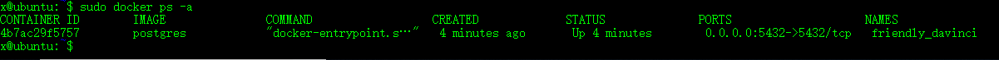
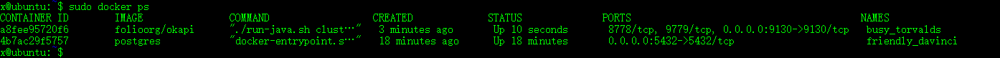

> - https://hub.docker.com/u/folioorg/  
> - https://hub.docker.com/r/folioci/  
> - https://github.com/folio-org/okapi/tree/master/okapi-core
> - https://github.com/folio-org/okapi/blob/master/doc/guide.md#okapi-program


folio的docker镜像可以从 https://hub.docker.com/u/folioorg/  此处获取。

在Ubuntu上以Docker方式部署需要参照以下步骤： 

1. 安装Docker  

安装docker必要工具
  ```
  sudo apt-get update
  sudo apt-get -y install apt-transport-https ca-certificates curl software-properties-common
  ```
   安装GPG证书
  ```
  curl -fsSL http://mirrors.aliyun.com/docker-ce/linux/ubuntu/gpg | sudo apt-key add -  
   ```
  写入软件源信息
  ```
  sudo add-apt-repository "deb [arch=amd64] http://mirrors.aliyun.com/docker-ce/linux/ubuntu $(lsb_release -cs) stable"
  ```
   更新并安装Docker-CE
  ```
  sudo apt-get -y update
  sudo apt-get -y install docker-ce
  ```
2. 安装Okapi

  获取Okapi 镜像
  ```
  sudo docker pull folioorg/okapi
  ```
  查看获取的镜像
  ```
  sudo docker images
  ```
    
  运行镜像，此处以集群方式运行(cluster)可以使用dev模式
  ```
  sudo docker run -p 9130:9130 -e JAVA_OPTIONS="-Dloglevel=DEBUG" folioorg/okapi cluster
  ```
  查看镜像运行状态
  ```
  sudo docker ps -a
  ```
   
   通过了浏览器访问 
   ```
   http://127.0.0.1:9130
    
    会提示如下信息：
    
    No suitable module found for path / for tenant supertenant
    
    表明Okapi 已经运行。
   
   ```
3. 以数据库存储方式运行Okapi——以PostgreSQL为例
    获取PostgreSQL镜像
    ```
    sudo docker pull postgres
    ```
    运行postgreSQL数据库，并创建okapi用户及数据库
    ```
    sudo docker run -e POSTGRES_USER=okapi -e POSTGRES_PASSWORD=okapi -e POSTGRES_DB=okapi -d -p 5432:5432 postgres
    ```
    查看数据库运行情况
    ```
    sudo docker ps -a
    ```
    结果如下
      
    以数据库存储方式运行Okapi
    ```
    sudo docker run -p 9130:9130 -e JAVA_OPTIONS="-Dloglevel=DEBUG -Dstorage=postgres -Dostgres_username=okapi -Dpostgres_password=okapi -Dpostgres_database=okapi -Dpostgres_host=192.168.75.131" folioorg/okapi cluster
    ```
      
      
    
